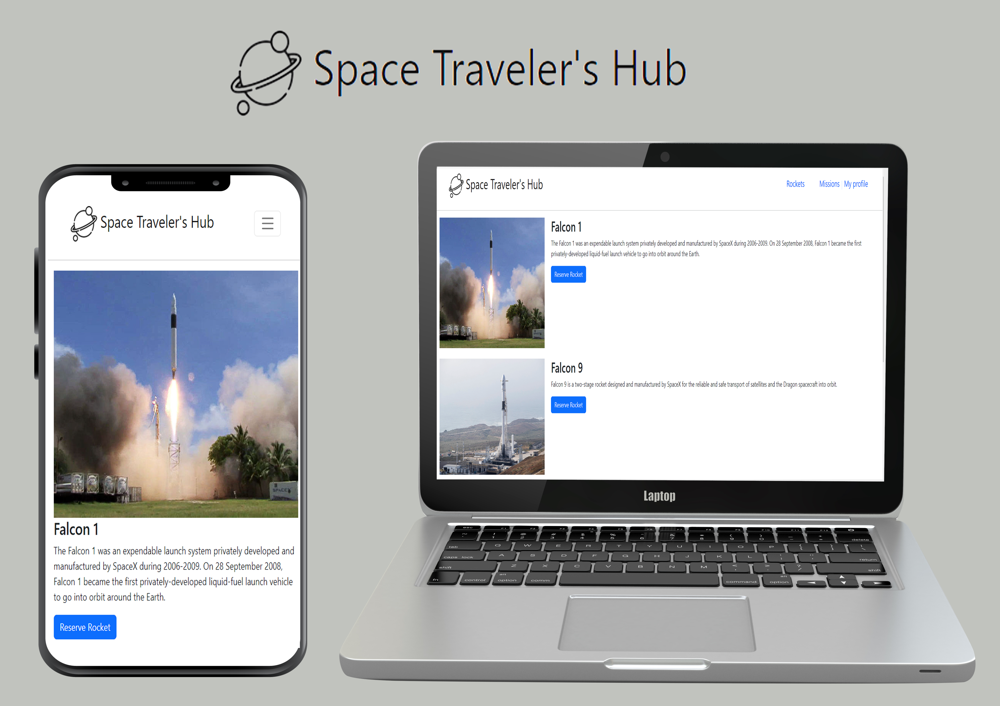

  <!-- You are encouraged to replace this logo with your own! Otherwise you can also remove it. -->
  
   
  <h3> 🚀 <b>Space Travelers' Hub</b> 🚀</h3>

# 📗 Table of Contents

- [📖 About the Project](#about-project)
  - [:camera: project screenshot](#screen-shoot)
  - [🛠 Built With](#built-with)
    - [Tech Stack](#tech-stack)
    - [Key Features](#key-features)
  - [🚀 Live Demo](#live-demo)
- [💻 Getting Started](#getting-started)
  - [Setup](#setup)
  - [Prerequisites](#prerequisites)
  - [Install](#install)
  - [Usage](#usage)
- [👥 Authors](#authors)
- [🔭 Future Features](#future-features)
- [🤝 Contributing](#contributing)
- [⭐️ Show your support](#support)
- [🙏 Acknowledgements](#acknowledgements)
- [📝 License](#license)

# 🚀 Space Travelers' Hub 

 A web application for a company that provides commercial and scientific space travel services. The application will allow users to book rockets and join selected space missions.

## 🛠 Built With 

> HTML 5 , css3, javascript ES6, React , Redux and external API

### Tech Stack 

> React, redux, axios, jest webpack and babel

### Key Features 

 <li>Space Travelers' Hub</li>
  

(<a href="#readme-top">back to top</a>)
<!-- LIVE DEMO -->

## 🚀 Live Demo 
- Here is a [Live Demo Link](https://space-travelers-dycl.onrender.com/)
## Project Screenshots

(<a href="#readme-top">back to top</a>)

## 💻 Getting Started 

To run on your localhost clone the project to local folder

- copy [this link](https://github.com/zewdu444/space_travelers.git).
- get the directory that you want to clone the repository.
- open the command prompt in this directory.
- write git clone git@github.com:Ibizugbe/space-travellers.git
- go to the repository folder in your command prompt cd Space-travellers
- use npm install to install the dependencies.
- use npm start to start live server.

### Setup

(<a href="#readme-top">back to top</a>)

### Prerequisites

In order to run this project you only need:

- Have a working and updated browser
- Have a local version control like git install on your computer
- Have an account and sign in on GitHub, as online/remote version control system
- Basic knowledge in JS and React JS

### Install

To install this project in your local machine use

- Clone the git repo using this command: `git clone https://github.com/zewdu444/space_travelers.git`

### Usage

To run the project, execute the following command:

- In visual studio code open terminal then write "npm start" after on your browser open "http://localhost:3000".
### Run tests

- `npx stylelint "/*.{css,scss}"**`: To test css code
- `npx eslint .` : To test Eslint Report

### To test the application

- `npm install --save-dev jest`
- `npm test`

## 👥 Authors 

👤 **zewdu erkyhun**

- GitHub: [@zewdu444](https://github.com/zewdu444)
- Twitter: [@zewdu444](https://twitter.com/zewdu444)
- LinkedIn: [zewdu-erkyhun](https://www.linkedin.com/in/zewdu-erkyhun-081378b3/)

👤 **Chukwuemeka Ochuba**

- GitHub: [@Donmark2k](https://github.com/Donmark2k)
- Twitter: [@donmark2k](https://twitter.com/donmark2k)
- LinkedIn: [LinkedIn](https://www.linkedin.com/in/chukwuemeka-ochuba/)

## 🔭 Future Features 
- I will add time and date below the nav bar
- I will add footer

## 🤝 Contributing 

Contributions, issues, and feature requests are welcome!

Feel free to check the [issues page](https://github.com/zewdu444/space_travelers/issues).

(<a href="#readme-top">back to top</a>)

## ⭐️ Show your support 

- Give a ⭐️ if you like this project!

(<a href="#readme-top">back to top</a>)

## 🙏 Acknowledgments 

I would like to appreciate [Microverse](https://www.microverse.org/) for providing the resources and the platform for us to be a Professional full-stack developer.

(<a href="#readme-top">back to top</a>)

## 📝 License 

This project is [MIT](./LICENSE) licensed.

(<a href="#readme-top">back to top</a>)

